```mermaid
architecture-beta
    group aws_cloud(cloud)[AWS Cloud Infrastructure]
    
    service client1(internet)[Client 1 (Browser)]
    service client2(internet)[Client 2 (Browser)]
    service alb(load-balancer)[Application Load Balancer\nWith Sticky Sessions]
    service app1(server)[App Server 1\nEC2 Instance] in aws_cloud
    service app2(server)[App Server 2\nEC2 Instance] in aws_cloud
    service redis(database)[Redis Server\nEC2 Instance] in aws_cloud
    
    client1:R --> L:alb
    client2:R --> L:alb
    alb:R --> L:app1
    alb:R --> L:app2
    app1:B --> T:redis
    app2:B --> T:redis
```

**🔄 Redis Shared State Architecture:**

**Shared via Redis:**
- Chat messages broadcast to all connected clients
- System notifications across all servers
- Real-time communication channels

**Local per Server:**
- Todo lists stored in memory
- Client session data
- WebSocket connection state

**How it works:**
1. Clients connect via load balancer with session affinity
2. Chat messages are published to Redis pub/sub channels
3. All app servers subscribe and broadcast to their clients
4. Todos remain local to maintain data consistency
