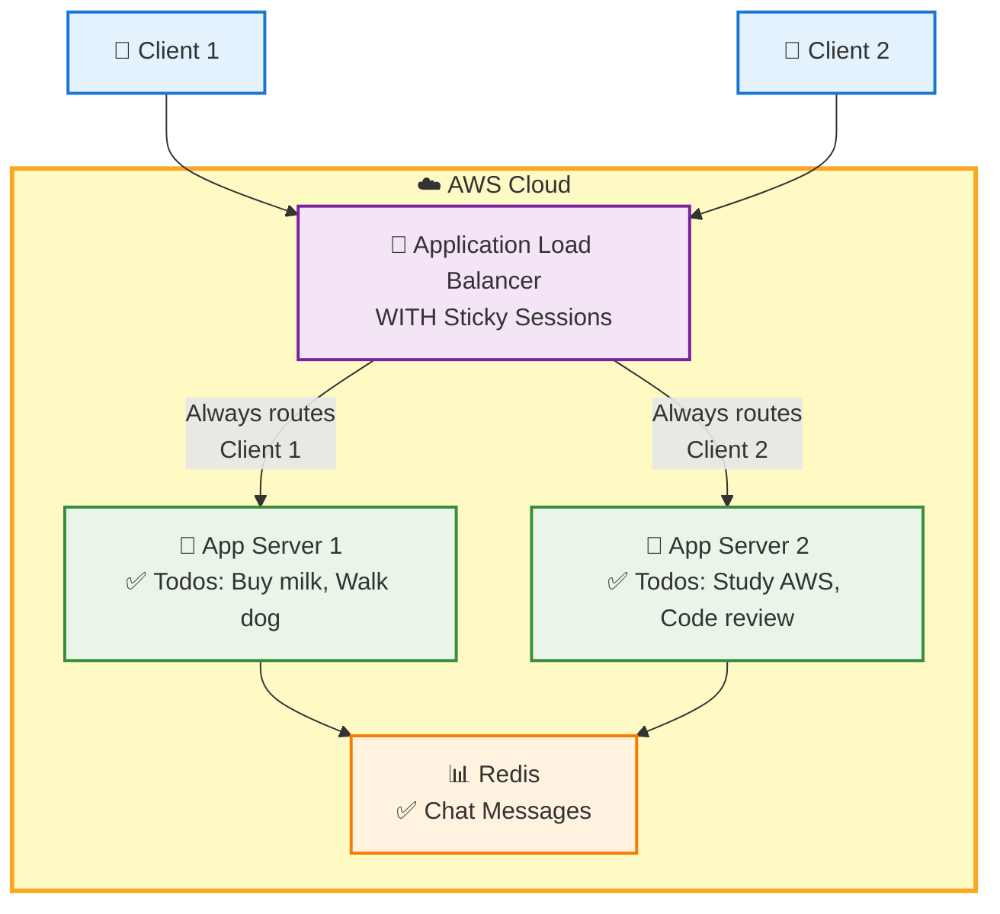
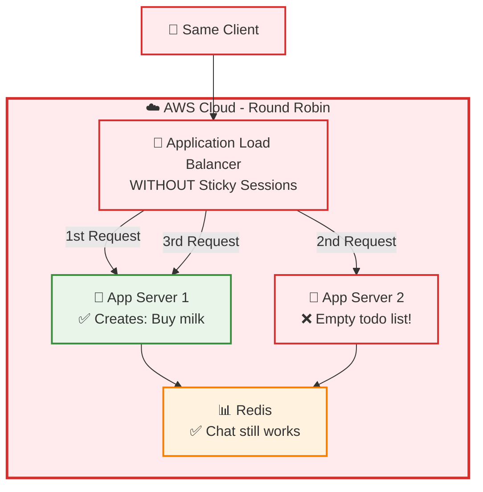

```mermaid
flowchart TD
    C1[👤 Client 1] --> ALB[🔄 Application Load Balancer<br/>WITH Sticky Sessions]
    C2[👤 Client 2] --> ALB
    
    ALB -->|Always routes<br/>Client 1| A1[🚀 App Server 1<br/>✅ Todos: Buy milk, Walk dog]
    ALB -->|Always routes<br/>Client 2| A2[🚀 App Server 2<br/>✅ Todos: Study AWS, Code review]
    
    A1 --> R[📊 Redis<br/>✅ Chat Messages]
    A2 --> R
    
    subgraph AWS["☁️ AWS Cloud"]
        ALB
        A1
        A2
        R
    end
    
    classDef client fill:#e3f2fd,stroke:#1976d2,stroke-width:2px
    classDef alb fill:#f3e5f5,stroke:#7b1fa2,stroke-width:2px
    classDef server fill:#e8f5e8,stroke:#388e3c,stroke-width:2px
    classDef redis fill:#fff3e0,stroke:#f57c00,stroke-width:2px
    classDef aws fill:#fff9c4,stroke:#f9a825,stroke-width:3px
    
    class C1,C2 client
    class ALB alb
    class A1,A2 server
    class R redis
    class AWS aws
```

**✅ With Sticky Sessions: Todos persist per client**

---

```mermaid
flowchart TD
    SC[👤 Same Client] --> ALBRR[🔄 Application Load Balancer<br/>WITHOUT Sticky Sessions]
    
    ALBRR -->|1st Request| AS1[🚀 App Server 1<br/>✅ Creates: Buy milk]
    ALBRR -->|2nd Request| AS2[🚀 App Server 2<br/>❌ Empty todo list!]
    ALBRR -->|3rd Request| AS1
    
    AS1 --> RR[📊 Redis<br/>✅ Chat still works]
    AS2 --> RR
    
    subgraph AWSRR["☁️ AWS Cloud - Round Robin"]
        ALBRR
        AS1
        AS2
        RR
    end
    
    classDef client fill:#ffebee,stroke:#d32f2f,stroke-width:2px
    classDef alb fill:#ffebee,stroke:#d32f2f,stroke-width:2px
    classDef server1 fill:#e8f5e8,stroke:#388e3c,stroke-width:2px
    classDef server2 fill:#ffebee,stroke:#d32f2f,stroke-width:2px
    classDef redis fill:#fff3e0,stroke:#f57c00,stroke-width:2px
    classDef aws fill:#ffebee,stroke:#d32f2f,stroke-width:3px
    
    class SC client
    class ALBRR alb
    class AS1 server1
    class AS2 server2
    class RR redis
    class AWSRR aws
```

**❌ Without Sticky Sessions: Todos are lost when switching servers**
