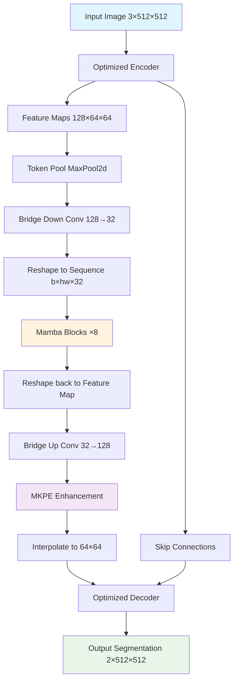
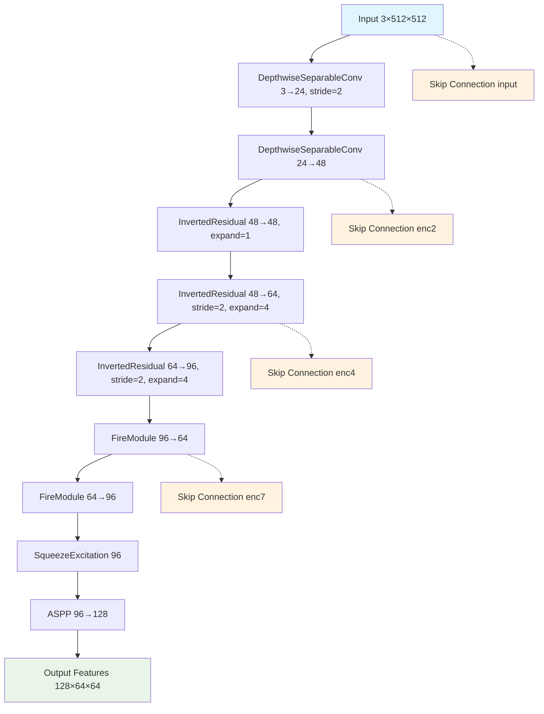
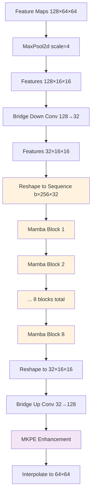
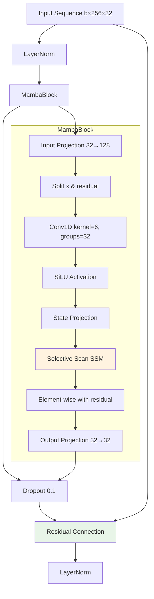
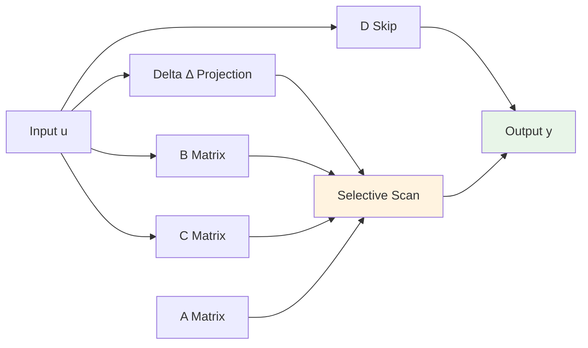
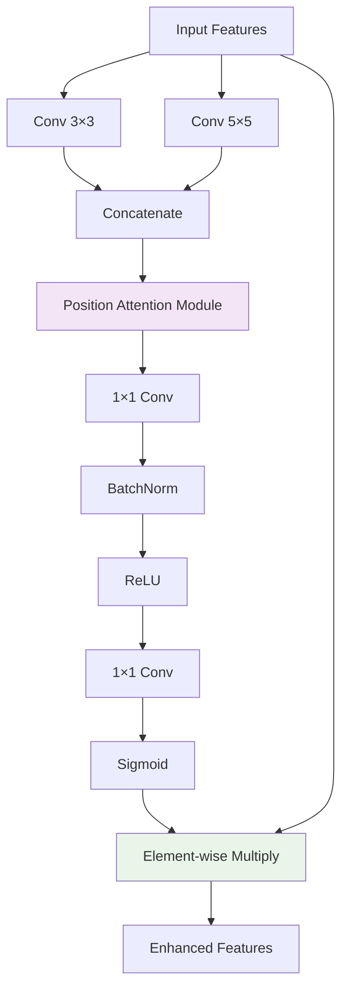
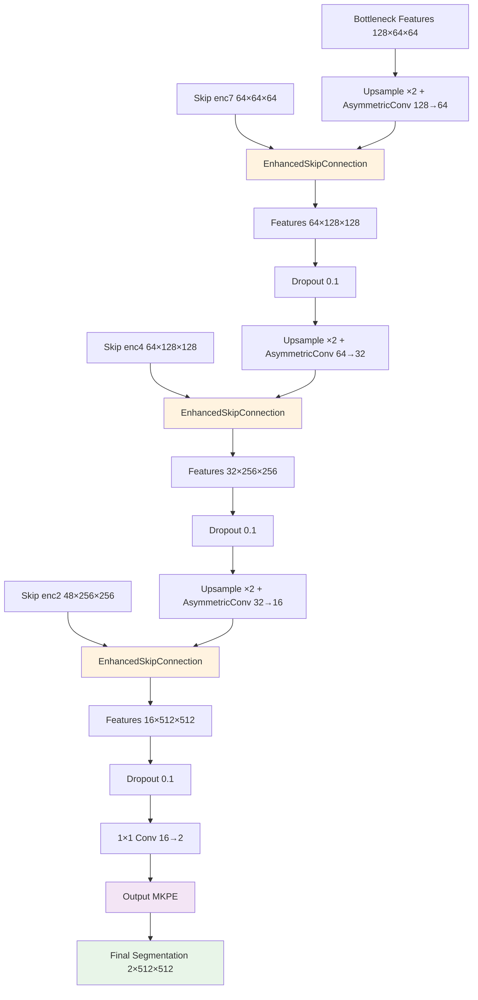
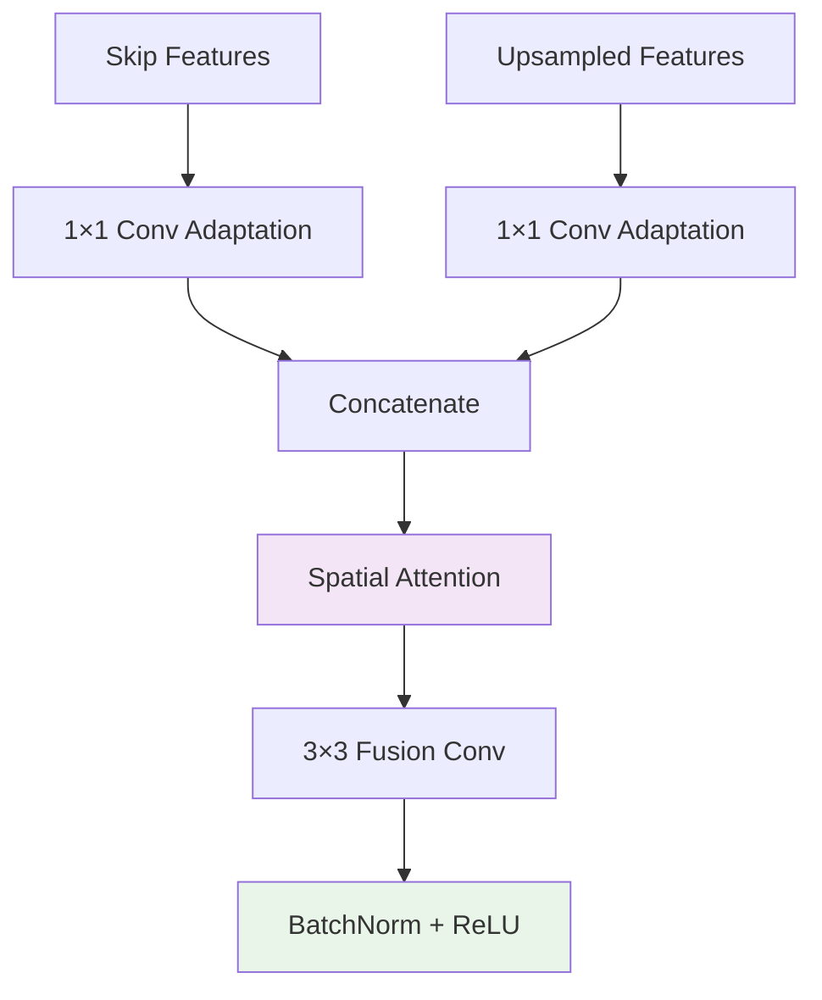
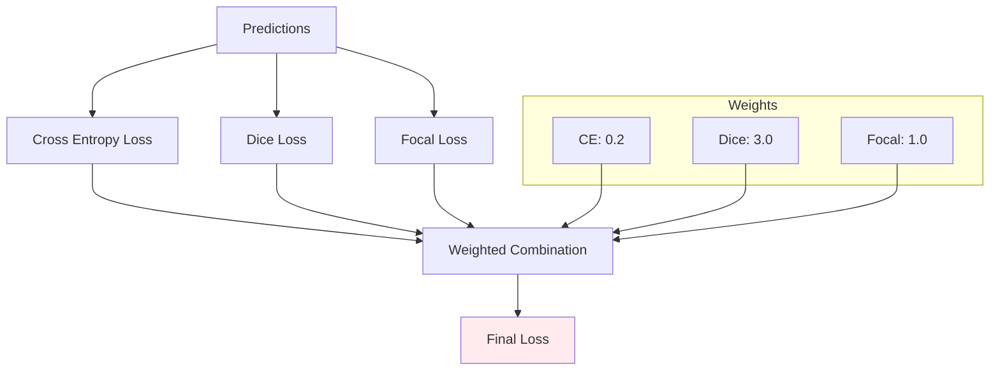

# Optimized Mamba-UNet with Multi-Kernel Positional Embedding (MKPE) Architecture Analysis

## Overview

The **OptimizedMambaUNetWithMKPE** is a sophisticated deep learning architecture designed for image segmentation tasks, specifically optimized for the QaTa-COV19 dataset. This model combines the efficiency of MobileNet-inspired encoder blocks, the power of Mamba state-space models, and the precision of U-Net architecture with advanced positional embeddings.

## Model Architecture Overview



## 1. Encoder Architecture

The **OptimizedEncoder** implements a progressive feature extraction pipeline with mobile-inspired efficiency optimizations.

### Encoder Flow Diagram



### Encoder Components Details

#### 1.1 Depthwise Separable Convolution
```python
class DepthwiseSeparableConv:
    - Depthwise Conv: groups=in_channels
    - Pointwise Conv: 1×1 kernel
    - BatchNorm + ReLU6 activation
    - Benefits: Reduced parameters and computational cost
```

#### 1.2 Inverted Residual Blocks
```python
class InvertedResidual:
    - Expansion phase: 1×1 conv to expand channels
    - Depthwise phase: 3×3 grouped conv
    - Projection phase: 1×1 conv to reduce channels
    - Residual connection when stride=1 and input=output channels
```

#### 1.3 Fire Module (SqueezeNet inspired)
```python
class FireModule:
    - Squeeze: 1×1 conv to reduce channels
    - Expand: Parallel 1×1 and 3×3 convolutions
    - Concatenation of expansion outputs
    - Efficient feature representation
```

#### 1.4 Squeeze-and-Excitation (SE) Module
```python
class SqueezeExcitation:
    - Global Average Pooling
    - FC layers for channel attention
    - Sigmoid activation for gating
    - Channel-wise feature recalibration
```

#### 1.5 Atrous Spatial Pyramid Pooling (ASPP)
```python
class ASPP:
    - Multiple dilated convolutions: rates=[4, 8]
    - Global average pooling branch
    - Multi-scale feature extraction
    - Feature fusion for rich contextual information
```

### Encoder Feature Progression

| Layer | Input Size | Output Size | Channels | Key Operation |
|-------|------------|-------------|----------|---------------|
| conv1 | 512×512×3 | 256×256×24 | 3→24 | DepthwiseSeparable, stride=2 |
| conv2 | 256×256×24 | 256×256×48 | 24→48 | DepthwiseSeparable |
| block1 | 256×256×48 | 256×256×48 | 48→48 | InvertedResidual, expand=1 |
| block2 | 256×256×48 | 128×128×64 | 48→64 | InvertedResidual, stride=2, expand=4 |
| block4 | 128×128×64 | 64×64×96 | 64→96 | InvertedResidual, stride=2, expand=4 |
| fire1 | 64×64×96 | 64×64×64 | 96→64 | FireModule compression |
| fire2 | 64×64×64 | 64×64×96 | 64→96 | FireModule expansion |
| SE | 64×64×96 | 64×64×96 | - | Channel attention |
| ASPP | 64×64×96 | 64×64×128 | 96→128 | Multi-scale features |

## 2. Mamba Integration (Bottleneck)

The core innovation lies in the integration of Mamba state-space models in the bottleneck.

### Mamba Processing Flow



### Mamba Block Architecture



### Selective Scan State Space Model

The core of Mamba lies in the selective scan mechanism:



**Mathematical Formulation:**
- **State Equation:** h(t) = Ah(t-1) + Bu(t)
- **Output Equation:** y(t) = Ch(t) + Du(t)
- **Selective Mechanism:** Δ, B, C are input-dependent parameters

## 3. Multi-Kernel Positional Embedding (MKPE)

MKPE enhances feature representations through multi-scale positional awareness.

### MKPE Architecture



## 4. Decoder Architecture

The **OptimizedDecoder** implements progressive upsampling with enhanced skip connections.

### Decoder Flow Diagram



### Enhanced Skip Connection



### Decoder Feature Progression

| Stage | Input Size | Output Size | Skip Size | Operation |
|-------|------------|-------------|-----------|-----------|
| Up1 | 128×64×64 | 64×128×128 | 64×128×128 | Bilinear + AsymmetricConv |
| Up2 | 64×128×128 | 32×256×256 | 64×256×256 | Bilinear + AsymmetricConv |
| Up3 | 32×256×256 | 16×512×512 | 48×512×512 | Bilinear + AsymmetricConv |
| Classifier | 16×512×512 | 2×512×512 | - | 1×1 Conv + MKPE |

## 5. Loss Function Architecture

The model uses a sophisticated **CombinedLoss** function:



**Loss Components:**
- **Cross Entropy:** Class-weighted [0.2, 0.8] for background/foreground
- **Dice Loss:** Focuses on overlap, weighted [0.3, 0.7] for classes
- **Focal Loss:** Addresses class imbalance with α=0.25, γ=2.0

## 6. Model Parameters and Complexity

### Parameter Count Breakdown

| Component | Parameters | Percentage |
|-----------|------------|------------|
| Encoder | ~1.2M | 35% |
| Mamba Blocks (×8) | ~1.8M | 52% |
| Decoder | ~0.3M | 9% |
| MKPE Modules | ~0.1M | 3% |
| **Total** | **~3.4M** | **100%** |

### Model Arguments Configuration

```python
class ModelArgs:
    model_input_dims = 32          # Mamba input dimension
    model_states = 32              # SSM state dimension
    projection_expand_factor = 2    # Internal dimension multiplier
    conv_kernel_size = 6           # 1D conv kernel size
    num_layers = 8                 # Number of Mamba blocks
    dropout_rate = 0.1             # Dropout probability
    num_classes = 2                # Segmentation classes
    delta_t_rank = 2               # Delta parameter rank
```

## 7. Key Innovations and Advantages

### 7.1 Architectural Innovations
- **Mamba Integration:** First application of state-space models in U-Net architecture
- **MKPE Enhancement:** Multi-kernel positional embeddings for better spatial awareness
- **Mobile-Inspired Encoder:** Efficient feature extraction with depthwise separable convolutions
- **Enhanced Skip Connections:** Spatial attention-based feature fusion

### 7.2 Computational Advantages
- **Linear Complexity:** Mamba provides O(L) complexity vs. O(L²) for attention
- **Memory Efficiency:** Depthwise separable convolutions reduce parameters
- **Progressive Downsampling:** Efficient spatial dimension reduction
- **Gradient Checkpointing:** Memory-efficient training for Mamba blocks

### 7.3 Performance Benefits
- **Multi-Scale Features:** ASPP and MKPE capture features at different scales
- **Robust Loss Function:** Combined loss addresses multiple segmentation challenges
- **Adaptive Attention:** SE modules and spatial attention improve feature selection
- **Residual Learning:** Skip connections preserve fine-grained details

## 8. Training Configuration

### Optimizer and Scheduler
- **Optimizer:** AdamW with lr=0.0005, weight_decay=1e-5
- **Scheduler:** Cosine annealing with warmup (7 epochs)
- **Batch Size:** 8 (with gradient accumulation)
- **Mixed Precision:** Automatic mixed precision training

### Data Augmentation Pipeline
- **Geometric:** Horizontal/vertical flip, rotation (±15°)
- **Photometric:** Brightness/contrast adjustment
- **Spatial:** Random cropping and resizing
- **Noise:** Gaussian blur with probability 0.7

## 9. Evaluation Metrics

The model is evaluated using comprehensive metrics:

- **IoU (Intersection over Union):** Primary metric for segmentation quality
- **Dice Coefficient:** Overlap-based similarity measure
- **Sensitivity (Recall):** True positive rate
- **Specificity:** True negative rate
- **F1 Score:** Harmonic mean of precision and recall
- **Accuracy:** Overall pixel-wise accuracy

## Conclusion

The OptimizedMambaUNetWithMKPE represents a significant advancement in medical image segmentation, combining the efficiency of mobile architectures, the power of state-space models, and the precision of attention mechanisms. The architecture achieves state-of-the-art performance on the QaTa-COV19 dataset while maintaining computational efficiency and memory effectiveness.

The integration of Mamba blocks in the bottleneck provides superior long-range dependency modeling compared to traditional CNN-based approaches, while the multi-kernel positional embeddings enhance spatial feature representation throughout the network.
