```mermaid
flowchart TD
    %% Clients
    C1[👤 Client 1<br/>Browser] --> ALB[🔄 Load Balancer<br/>Session Affinity]
    C2[👤 Client 2<br/>Browser] --> ALB
    C3[👤 Client 3<br/>Browser] --> ALB
    
    %% App Servers
    ALB --> AS1[🚀 App Server 1<br/>In-Memory Todos<br/>WebSocket Handler]
    ALB --> AS2[🚀 App Server 2<br/>In-Memory Todos<br/>WebSocket Handler]
    
    %% Redis Pub/Sub
    AS1 -->|PUBLISH chat_channel| R[📊 Redis Server<br/>Pub/Sub Broker<br/>Message Routing]
    AS2 -->|PUBLISH chat_channel| R
    
    R -->|SUBSCRIBE chat_channel| AS1
    R -->|SUBSCRIBE chat_channel| AS2
    
    %% Client Data Storage
    AS1 -.->|Stores| TD1[📝 Client 1 Todos<br/>Buy milk, Walk dog]
    AS2 -.->|Stores| TD2[📝 Client 2 Todos<br/>Study AWS, Code review]
    
    %% Message Broadcasting
    AS1 -->|Broadcast to| C1
    AS1 -->|Broadcast to| C2
    AS2 -->|Broadcast to| C2
    AS2 -->|Broadcast to| C3
    
    subgraph Shared["🔄 Redis Shared State"]
        R
    end
    
    subgraph Local["💾 Server-Local State"]
        TD1
        TD2
    end
    
    %% Styling
    classDef client fill:#e3f2fd,stroke:#1976d2,stroke-width:2px,color:#000
    classDef server fill:#e8f5e8,stroke:#388e3c,stroke-width:2px,color:#000
    classDef redis fill:#fff3e0,stroke:#f57c00,stroke-width:2px,color:#000
    classDef todos fill:#f3e5f5,stroke:#7b1fa2,stroke-width:2px,color:#000
    classDef alb fill:#fce4ec,stroke:#c2185b,stroke-width:2px,color:#000
    classDef shared fill:#e8f5e8,stroke:#4caf50,stroke-width:3px,color:#000
    classDef local fill:#fff3e0,stroke:#ff9800,stroke-width:3px,color:#000
    
    class C1,C2,C3 client
    class AS1,AS2 server
    class R redis
    class TD1,TD2 todos
    class ALB alb
    class Shared shared
    class Local local
    
    %% Bold blue arrows for main flow
    linkStyle 0 stroke:#1976d2,stroke-width:4px
    linkStyle 1 stroke:#1976d2,stroke-width:4px
    linkStyle 2 stroke:#1976d2,stroke-width:4px
    linkStyle 3 stroke:#1976d2,stroke-width:4px
    linkStyle 4 stroke:#1976d2,stroke-width:4px
    linkStyle 5 stroke:#f57c00,stroke-width:4px
    linkStyle 6 stroke:#f57c00,stroke-width:4px
    linkStyle 7 stroke:#4caf50,stroke-width:3px
    linkStyle 8 stroke:#4caf50,stroke-width:3px
```

**🔄 Redis Shared State Pattern:**
- **Chat Messages:** Shared across all servers via Redis pub/sub
- **Todo Lists:** Stored locally in each server's memory
- **Session Affinity:** Ensures users connect to the same server
- **Real-time Broadcasting:** Messages reach all connected clients regardless of server
