```mermaid
flowchart TD
    %% Clients
    C1[🌐 Client 1 Browser] --> ALB[⚖️ Application Load Balancer]
    C2[🌐 Client 2 Browser] --> ALB
    C3[🌐 Client 3 Browser] --> ALB
    
    %% App Servers
    ALB --> AS1[🖥️ App Server 1<br/>Local Todos]
    ALB --> AS2[🖥️ App Server 2<br/>Local Todos]
    
    %% Redis Shared State
    AS1 -->|PUBLISH| R[🔥 Redis<br/>Shared State Store]
    AS2 -->|PUBLISH| R
    R -.->|SUBSCRIBE| AS1
    R -.->|SUBSCRIBE| AS2
    
    %% AWS Infrastructure
    subgraph AWS["☁️ AWS Network Infrastructure"]
        ALB
        AS1
        AS2
        R
    end
    
    %% Styling
    classDef client fill:#e3f2fd,stroke:#1976d2,stroke-width:2px,color:#000
    classDef alb fill:#fce4ec,stroke:#c2185b,stroke-width:2px,color:#000
    classDef server fill:#e8f5e8,stroke:#388e3c,stroke-width:2px,color:#000
    classDef redis fill:#fff3e0,stroke:#f57c00,stroke-width:2px,color:#000
    classDef aws fill:#e8eaf6,stroke:#3f51b5,stroke-width:3px,color:#000
    
    class C1,C2,C3 client
    class ALB alb
    class AS1,AS2 server
    class R redis
    class AWS aws
    
    %% Bold blue arrows
    linkStyle 0 stroke:#1976d2,stroke-width:4px
    linkStyle 1 stroke:#1976d2,stroke-width:4px
    linkStyle 2 stroke:#1976d2,stroke-width:4px
    linkStyle 3 stroke:#1976d2,stroke-width:4px
    linkStyle 4 stroke:#1976d2,stroke-width:4px
    linkStyle 5 stroke:#1976d2,stroke-width:4px
    linkStyle 6 stroke:#1976d2,stroke-width:4px
    linkStyle 7 stroke:#1976d2,stroke-width:3px
    linkStyle 8 stroke:#1976d2,stroke-width:3px
```

**🔄 Redis Shared State Architecture:**

**Shared via Redis:**
- Chat messages broadcast to all connected clients
- System notifications across all servers
- Real-time communication channels
- Cross-server data synchronization

**Local per Server:**
- Todo lists stored in memory
- Client session data
- WebSocket connection state
- User-specific application state

**How it works:**
1. Clients connect via load balancer with session affinity
2. Chat messages are published to Redis shared state store
3. Redis broadcasts to all app servers maintaining shared state
4. Todos remain local to each server for data consistency
5. Both servers subscribe to Redis for real-time updates
